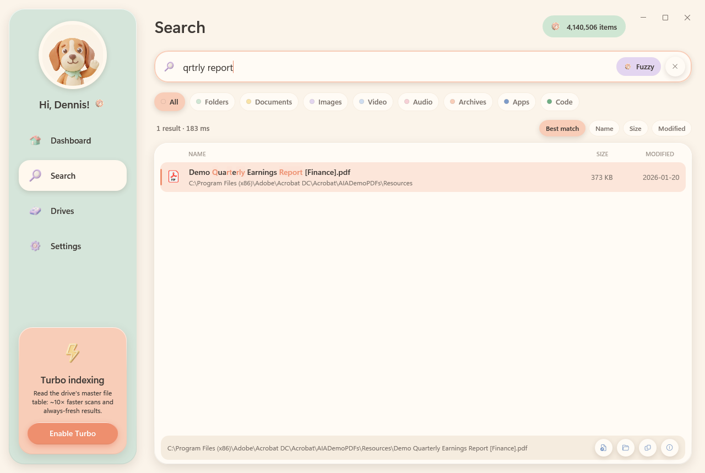
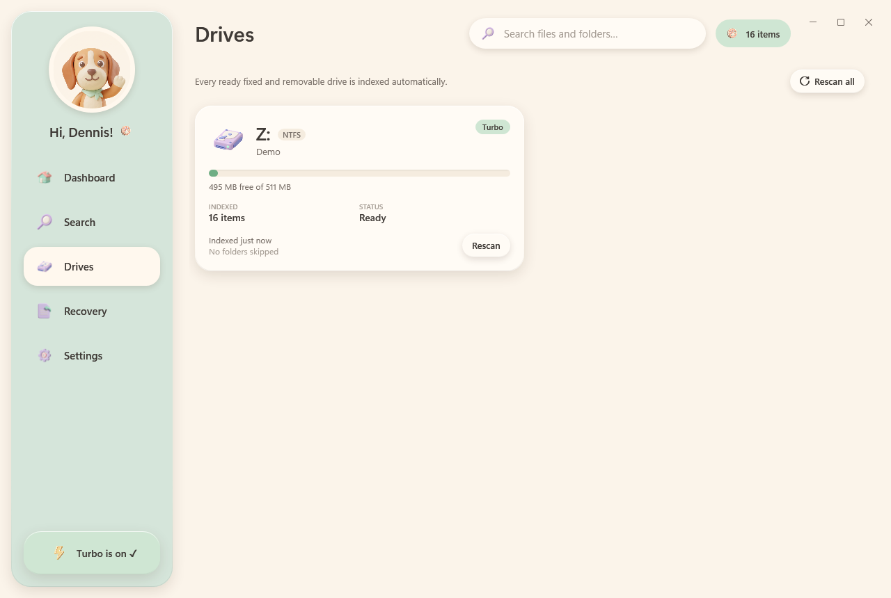

# FileHound 🐾

**Fast, friendly file finding for every drive on Windows 11.**
FileHound indexes every file and folder on all your local drives (C:, D:, E:, USB disks…) and finds them as you type, even with missing letters or typos, in a soft pastel "clay" interface.


| Search (fuzzy) | Drives |
|---|---|
|  |  |

## Highlights

- **Whole-disk coverage.** Every ready fixed and removable drive is indexed, whatever its filesystem (NTFS, exFAT, FAT32, ReFS).
- **Instant search.** A parallel, allocation-free engine searches 4 million entries in about 10–80 ms.
- **Fuzzy ("blur") matching.** Results are ranked by match quality, best first:
  - exact name
  - prefix
  - start of a word (`final_report`, `FinalReport`)
  - anywhere in the name
  - letters in order: `qrtrly` → *quarterly_report.xlsx*
  - small typos: `quartelry`, `budjet`
- **Always fresh.** Live updates come from the NTFS USN journal (Turbo mode) or FileSystemWatcher (Standard mode).
- **Fast restarts.** Each drive's index is saved as a compact binary snapshot, and 4 million entries load in about 1 second.
- **Everything-style query syntax** with category chips, sorting and match highlighting.
- **Built for the keyboard.** Global hotkey, tray icon, Enter to open, Ctrl+Enter to open the containing folder, Ctrl+Shift+C to copy the path, and drag a result out to Explorer.
- **Self-healing.** If a live-update loop ever fails, FileHound says so and re-indexes the drive instead of quietly going stale.

## Install

1. Download `FileHound.exe` from the [latest release](https://github.com/Aldiharley/filehound/releases/latest). It is self-contained: no .NET install is needed.
2. Put it anywhere you like (for example `%LOCALAPPDATA%\Programs\FileHound`) and run it. Windows SmartScreen may warn the first time because the file is not code-signed; choose **More info → Run anyway**.
3. Press **Ctrl+Alt+Space** to search. If another app already uses that shortcut, FileHound picks the first free one instead (usually **Ctrl+Shift+Space**). **Settings → Global hotkey** shows which one is active and lets you change it. Turn on **Start with Windows** in Settings so the hotkey is always ready.

FileHound greets you by your Windows display name. Change it, or clear it to go back to automatic, under **Settings → General → Your name**.

To check a download, compare its hash with `SHA256SUMS.txt` from the same release:

```powershell
Get-FileHash .\FileHound.exe -Algorithm SHA256
```

Data lives in `%LOCALAPPDATA%\FileHound`: `settings.json`, the `index\*.fhx` snapshots, and `logs\`. To uninstall, exit FileHound from the tray, delete the exe and that folder, and turn off **Start with Windows** first if you had enabled it.

## Indexing modes

| | Standard (default) | Turbo |
|---|---|---|
| How | Parallel folder walk (`FileSystemEnumerable`) | Reads the NTFS master file table (MFT) directly, the technique Everything uses; three tiers, see below |
| Live updates | FileSystemWatcher | USN change journal |
| Speed (C:, ~5M entries) | 24 s warm / 161 s cold | 7.8 s, including sizes and dates (file-record tier) |
| Speed (M:, 2.5M entries, HDD) | | 25.6 s cold / 9.5 s warm, including sizes and dates (raw tier) |
| Restart | snapshot in ~1 s, then a background refresh walk | snapshot in ~1.5 s, journal catch-up, ready in ~2.3 s |

Turbo tries three ways of reading the MFT, fastest first, and falls back automatically:

1. **Raw `$MFT` read.** Sequential 4 MB reads straight from the volume, with names, sizes and dates in one pass. This is used unless the MFT is fragmented across extension records.
2. **Per-record reads with `FSCTL_GET_NTFS_FILE_RECORD`.** Several threads, one call per in-use record, still in one pass. This is used when raw volume reads are blocked; on the development PC, security software refuses them on C: with Win32 error 50.
3. **`FSCTL_ENUM_USN_DATA`.** This returns names only, and sizes and dates are filled in afterwards.

Turbo lists each hard-linked file under one of its names (as Everything does), while Standard mode lists every link.
| Needs | nothing | administrator approval, given once per launch via **Enable Turbo** |

When FileHound runs elevated it opens files through the normal desktop shell, so they never inherit admin rights. Drag-out is disabled while elevated, because Windows blocks dragging from an elevated app into a normal one.

## Recovery

The **Recovery** page brings deleted files back, one drive at a time, from these sources:

| Tab | Where it looks | Needs Turbo | Puts files |
|---|---|---|---|
| **Recycle Bin** | Every `$Recycle.Bin` on the drive (other accounts' bins too when elevated) | no | back in place (*Restore*) or in a folder on another drive (*Recover*) |
| **Recently deleted** | A log of deletions FileHound builds from the NTFS change journal, including files that skipped the bin (Shift+Delete, command line, apps). Each entry shows whether its MFT record is still free | yes | on another drive |
| **Undelete** | The master file table's deleted records, read raw from the volume (or from the physical disk, or from a shadow copy, when security software blocks volume reads). Each record is graded against the cluster bitmap: *Excellent*, *Good* (header doesn't match the type), *Partially overwritten (N %)*, *Overwritten*, *Zeroed* (SSD TRIM), *Encrypted*. Sparse and LZNT1-compressed files are reassembled | yes | on another drive |
| **Previous versions** | Windows shadow copies (restore points). Paste a path and every snapshot that still holds it is listed, newest first. *Freeze this drive now* creates a snapshot on demand, after a warning that it writes to the drive | yes | next to the current file as `name (from <date>).ext` (*Restore*) or in any folder (*Save*) |
| **Deep scan** | Every free cluster, read for file signatures. 23 validators measure each hit exactly (JPEG, PNG, GIF, BMP, TIFF, WebP, WAV/AVI, MP4/MOV, MKV, OGG, MP3, FLAC, PDF, ZIP incl. docx/xlsx/pptx/epub/odt/jar, 7z, RAR, GZIP, SQLite, EXE/DLL, Office 97-2003, RTF, PST, LNK), so a result is a whole file or nothing. Pause/resume/stop, type filters, previews (images, text, ZIP entries). Results are named `type_block.ext` | yes | on another drive |

Rules that always hold:

- **Read-only.** While the Recovery page is open on a drive, FileHound stops writing to it: no snapshot saves, no deletion-log saves. The drive's own index keeps updating in memory.
- **Different drive.** Anything recovered (as opposed to restored in place) must go to a folder on another volume, so a recovery can never overwrite the data it is recovering. The page refuses a destination on the source volume.
- **Honest grades.** Every candidate carries a chip: *Excellent*, *Recoverable (slot intact)*, *Record reused*, *In Recycle Bin*, *Unknown*. Tooltips say what the grade means and why.
- **Receipts.** Each recovered file is hashed (SHA-256) and listed in `manifest.csv` inside a `FileHound Recovery <date> <time>` folder; the lists export as CSV, and the session as [DFXML](https://github.com/dfxml-working-group/dfxml_schema) with the byte runs each undeleted file was read from.
- **Re-checked before copying.** Undelete re-reads the cluster bitmap just before copying a file; clusters reused since the scan downgrade the grade shown in the results instead of being silently copied as if intact.
- **Consent before the first deep scan.** The page explains once what a deep scan reads (all free space, including other accounts' deleted data), the SSD caveat, and why to use the PC as little as possible meanwhile.
- **Recovered programs are marked.** Carved `.exe`/`.dll`/scripts get the Mark-of-the-Web, so SmartScreen treats them as downloads.

The deletion log lives in `%LOCALAPPDATA%\FileHound\recovery\<letter>_<serial>.dlog` (last 50,000 deletions per drive) and is backfilled from the journal's history the first time Turbo runs, so deletions from before FileHound was installed show up too, as far back as the journal reaches.

## Query syntax

| Query | Meaning |
|---|---|
| `budget 2025` | both words (AND) |
| `invoice \| receipt` | either word (OR) |
| `report !draft` | exclude names containing *draft* |
| `"my notes"` | exact phrase, including the space |
| `*.log`, `img_????.jpg` | wildcards (must match the whole name) |
| `ext:pdf;docx` | by extension |
| `type:image`, `kind:video` | by category: `doc`, `image`, `video`, `audio`, `archive`, `app`, `code`, `folder` |
| `folder:projects`, `file:readme` | folders only / files only |
| `size:>1gb`, `size:10mb..2gb`, `size:huge` | by size; the buckets are `empty`, `tiny`, `small`, `medium`, `large`, `huge` and `gigantic` |
| `dm:today`, `dm:week`, `dm:2026-05`, `dm:>2026-01-01` | by date modified |
| `path:work`, `src\core` | matches anywhere in the folder path |
| `drive:E` | one drive only |

## Keyboard

| Keys | Action |
|---|---|
| **Ctrl+Alt+Space** | Show/hide FileHound from anywhere. If another app owns it, FileHound falls back to Ctrl+Shift+Space; you can change it in Settings. |
| ↓ / ↑ | Move between the search box and results |
| Enter / double-click | Open |
| Ctrl+Enter | Open the containing folder with the item selected |
| Ctrl+Shift+C / Ctrl+C | Copy the path / copy the file |
| Alt+Enter | Properties |
| Ctrl+1…9 | Pick a category chip |
| Esc | Clear the search, or hide the window if the search is already empty |

## Build & run

Requirements: Windows 10/11 and any [.NET 10 SDK](https://dotnet.microsoft.com/download). The published `FileHound.exe` is self-contained, so people who only run it need no .NET at all.

The quickest route is the bootstrap script. It installs the .NET 10 SDK if it is missing (winget first, Microsoft's per-user `dotnet-install` script as a fallback), then builds:

```powershell
.\build.ps1                 # check/install the SDK, build
.\build.ps1 -Test           # ...and run the tests
.\build.ps1 -Test -Install  # ...and publish FileHound.exe, install it for this user, add a Start Menu shortcut
```

Or by hand:

```bash
dotnet build FileHound.sln -c Release
```

```bash
dotnet run --project src/FileHound.App -c Release
```

```bash
dotnet test FileHound.sln -c Release
```

To publish a self-contained single-file executable:

```bash
dotnet publish src/FileHound.App -c Release -r win-x64 --self-contained -p:PublishSingleFile=true -p:IncludeNativeLibrariesForSelfExtract=true -o publish
```

### Releasing

Releases are built by GitHub Actions ([`.github/workflows/release.yml`](.github/workflows/release.yml)). Set `<Version>` in `Directory.Build.props`, add a `### x.y.z` section under [Changelog](#changelog), commit, then push a matching tag:

```bash
git tag -a v1.2.0 -m "FileHound 1.2.0" && git push origin main --follow-tags
```

The workflow builds, runs the tests, publishes the self-contained exe, and attaches `FileHound.exe`, the zip and `SHA256SUMS.txt` to a release whose notes come from that changelog section. It fails if the tag and `<Version>` disagree. Running it by hand (Actions → Release → Run workflow) builds the same files as a workflow artifact; tick *draft_release* to also rehearse the release step as a draft, which you then delete.

### Headless tools

```bash
dotnet run --project tools/FileHound.Cli -c Release -- scan C D --fresh
```

```bash
dotnet run --project tools/FileHound.Cli -c Release -- search "qrtrly report" --top 10
```

```bash
dotnet run --project tools/FileHound.Cli -c Release -- bench "report" "ext:pdf invoice" "size:>1gb"
```

The app also has a QA mode that renders every page to PNG: `FileHound.exe --snapshot <dir> [--query text] [--drives C] [--data dir]`.

## Architecture

```
FileHound.Core       pure .NET: struct-of-arrays VolumeIndex, query parser, matchers (fzf-style + Myers), SearchEngine, snapshots,
                     recovery models, Recycle Bin $I parser, deletion-log store, LZNT1 decoder, CSV/DFXML exports,
                     carving: signature table + 23 pure validators (exact size or reject)
FileHound.Indexing   Win32: drive discovery, MFT scanner, USN updater, parallel walker, FileSystemWatcher, IndexManager,
                     recovery: deletion log, journal gap oracle, Recycle Bin source, VolumeReader (volume / physical disk /
                     shadow copy), ClusterBitmap, MftUndeleteSource + UndeleteWriter, ShadowCopySource, Carver + CarveWriter,
                     RecoverySession
FileHound.App        WPF + CommunityToolkit.Mvvm: clay theme, Dashboard / Search / Drives / Recovery / Settings, tray, hotkey
tools/FileHound.Cli  headless scan / search / bench / recovery-probe
```

Design docs live in [`docs/superpowers/specs`](docs/superpowers/specs), the implementation plan in [`docs/superpowers/plans`](docs/superpowers/plans), and background research in [`docs/research`](docs/research).

## Changelog

### 1.4.0

- **Deep scan tab** (Turbo). Reads the drive's free clusters through `VolumeReader` and recognises files by signature with 23 pure validators that walk each format's structure and return an exact size (JPEG marker walk, PNG chunks with CRC, ISO-BMFF boxes, MKV EBML, MP3 frames, ZIP central directory, PE sections, OLE2 FAT, …). Hits are de-duplicated against Undelete, streamed into the list as they are found, filtered by type, sorted by type/size/location, and previewed (images decoded from memory, text snippets, ZIP entry lists). Pause, resume and stop; progress with an ETA in the header chip.
- **One-time consent** (FR-30) before the first deep scan, remembered in settings.
- Carved files recover as `type_block.ext` with SHA-256 and byte runs; recovered programs get the Mark-of-the-Web.
- Every validator is fuzzed in the test suite (random mutations must never throw or report a size past the data).

### 1.3.0

- **Undelete tab** (Turbo). Scans the master file table for deleted records, rebuilds each file's folder from the live index and other deleted folders (checking record sequence numbers so a reused folder is not trusted), and grades every candidate against the cluster bitmap plus a first-cluster signature check. Recovery reassembles data runs, zero-fills sparse runs, decompresses LZNT1 units, truncates to the real size, restores timestamps and hashes on the way; the bitmap is re-checked right before copying.
- **Reads the drive three ways.** `VolumeReader` tries the volume handle, then the physical disk at the partition offset, then the newest shadow-copy device, so Undelete works on system drives where security software refuses raw volume reads (the case on the development PC).
- **Previous versions tab** (Turbo). Lists every shadow copy that still holds a path, newest first, with *Restore* (next to the current file, never overwriting) and *Save to a folder*. *Freeze this drive now* creates a snapshot via `Win32_ShadowCopy` after a warning whose default is Cancel.
- The header status chip shows undelete progress and jumps back to Recovery when clicked; DFXML exports now carry `byte_run`s; the Recycle Bin and Previous versions tabs gained *Save to a folder…* for copying instead of restoring.
- Acceptance test: an elevated round trip on a throwaway VHDX (format, write, delete, overwrite, undelete, compare SHA-256).

### 1.2.0

- **Recovery page.** A new sidebar page brings deleted files back, drive by drive (see [Recovery](#recovery)):
  - **Recycle Bin tab.** Lists every bin on the drive with original name, folder, size and deletion time, parsed from the `$I` metadata files (v1 and v2). *Restore* puts items back in place (adding "(restored)" when the name is taken); *Recover* copies them to another drive.
  - **Recently deleted tab** (Turbo). FileHound now keeps a per-drive log of deletions from the USN change journal: plain deletes, moves to the Recycle Bin, Windows 11 POSIX deletes (the `$Extend\$Deleted` marker) and "replaced" saves. It is backfilled from the journal's history, hides temp/cache noise by default, and checks whether each file's MFT record is still free.
  - **Read-only sessions and the different-drive rule.** Opening the page on a drive suspends FileHound's own writes to it, and recovered files must go to another volume.
  - **Forensic extras.** SHA-256 per recovered file, `manifest.csv`, CSV export of any list and DFXML export of the session.
- **Turbo on Windows 11 POSIX deletes.** The journal updater now recognises the rename into `\$Extend\$Deleted` as the deletion, so such files leave the index immediately instead of when the later `FILE_DELETE` record arrives.
- New clay assets: a digging hound, a hound with a rescued file, and icons for Recycle Bin, timeline, undelete, shadow copies, deep scan, read-only and export.
- `FileHound.Cli recovery-probe` reports which raw-read paths (volume, physical disk, shadow copy) work on a drive.

### 1.1.0

- **Much faster Turbo indexing.** Turbo now reads the NTFS master file table itself and gets names, sizes and dates in one pass, with no separate "measuring files" step. It tries three ways, fastest first, and falls back automatically:
  - **Raw `$MFT` read.** Large sequential reads straight from the volume. On a 2.5M-entry HDD this takes 25.6 s cold and 9.5 s warm.
  - **Per-record reads with `FSCTL_GET_NTFS_FILE_RECORD`.** Used when security software blocks raw volume reads. A 5M-entry C: drive is indexed in 7.8 s, against 9 s plus a 20 s fill before.
  - **`FSCTL_ENUM_USN_DATA`.** The 1.0 method, kept as the last resort.

  Results were checked against the 1.0 method: entry counts are identical on both drives tested, and sampled sizes match the disk.
- **Greeting by name.** The sidebar uses your Windows display name (first name) and Settings → General gets a *Your name* override.
- **Self-contained release build and `build.ps1`.** The script installs the .NET 10 SDK if it is missing, then builds, tests, publishes and installs. Any 10.0.x SDK now satisfies `global.json`.
- **Safer Turbo mode.** Explorer is always launched by its full path, and Alt+Enter Properties is shown by the desktop's own Explorer instead of the elevated process, so nothing started from the sheet inherits admin rights.
- **No overlap on the Turbo relaunch.** The old instance keeps its lock until snapshots and settings are saved; the elevated copy waits for it.
- **Live updates report faults.** If the USN or FileSystemWatcher loop hits an unexpected error it is logged and the drive is re-indexed (at most once per ten minutes) instead of the index silently going stale.
- **Walker can no longer hang.** An unexpected error in one worker fails the walk with that error instead of leaving the drive stuck in *Scanning*.
- **MFT parser.** Bounds checks can no longer overflow on a corrupt record length; such records are skipped rather than knocking the drive back to Standard mode.
- Superseded indexes are released sooner during a refresh, and the snapshot-release test no longer depends on garbage-collection timing.

### 1.0.0

Initial version: whole-disk indexing in Standard and Turbo modes, fuzzy search with Everything-style syntax, snapshots, tray and global hotkey.

## License

Apache-2.0. See [`THIRD-PARTY-NOTICES.md`](THIRD-PARTY-NOTICES.md) for adapted work (fzf scoring, MIT) and packages.
