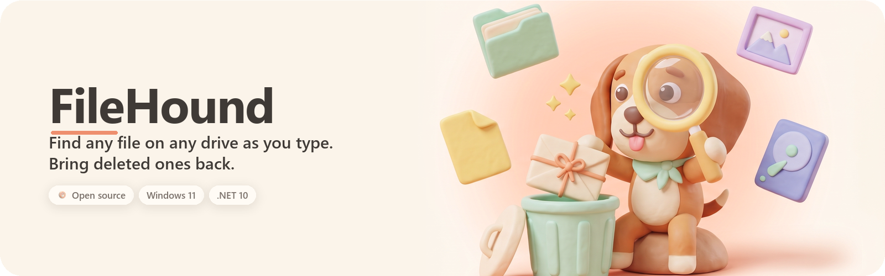
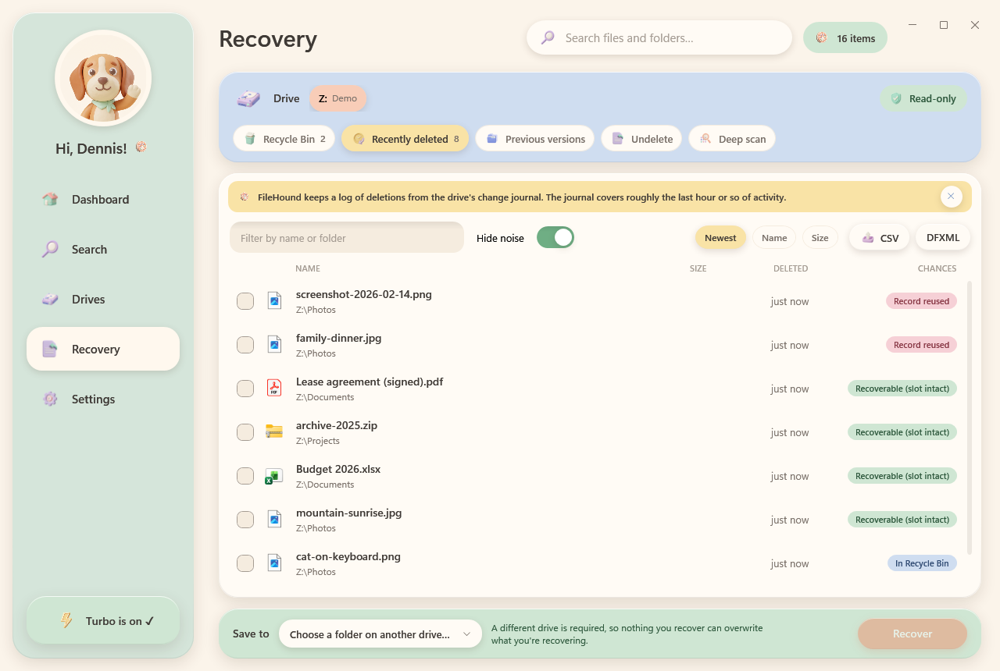
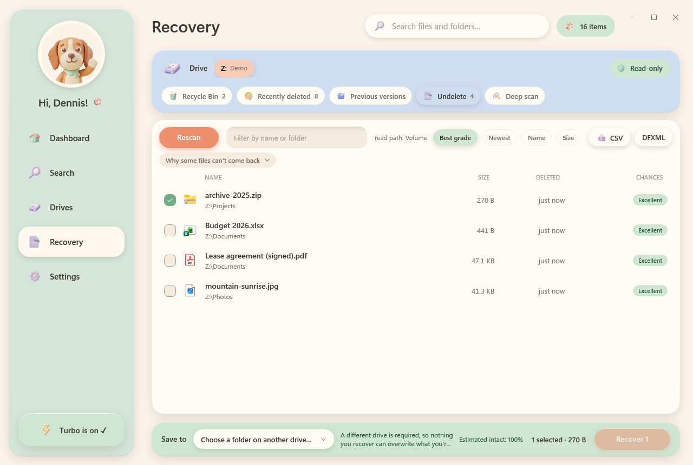
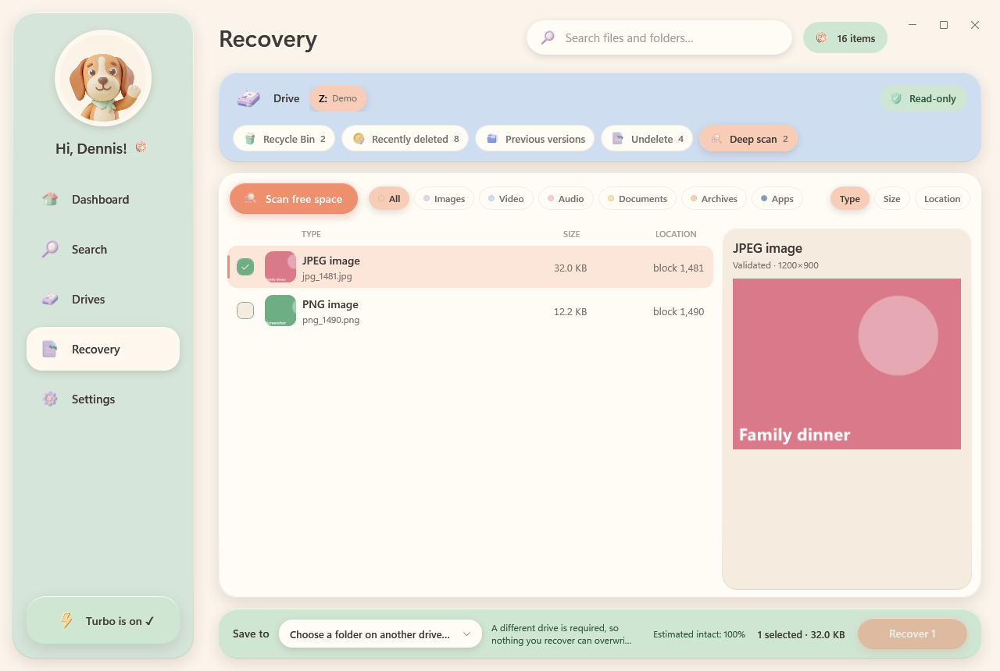
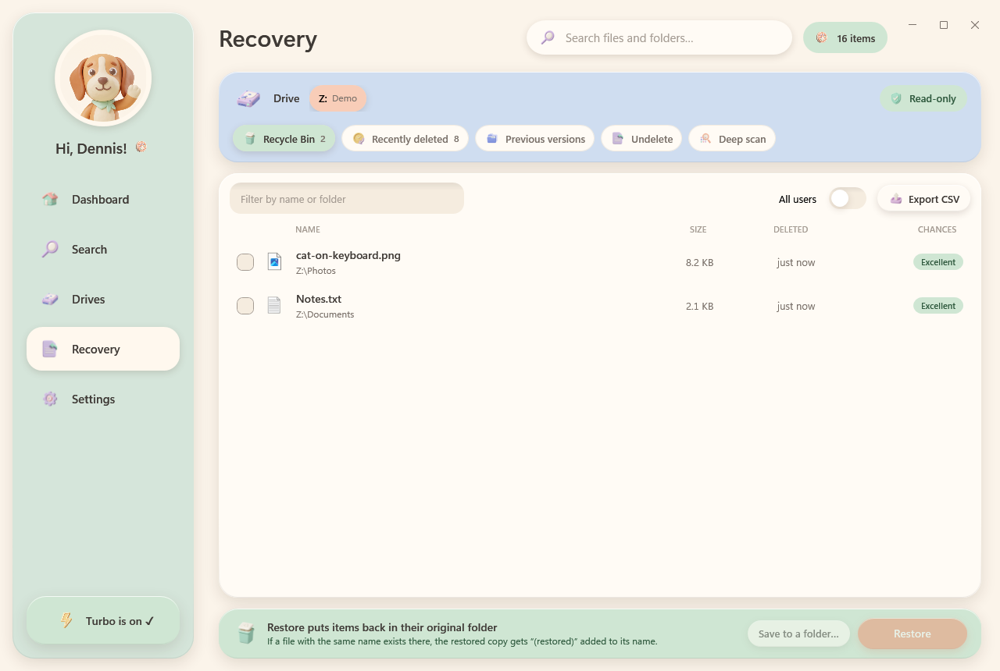
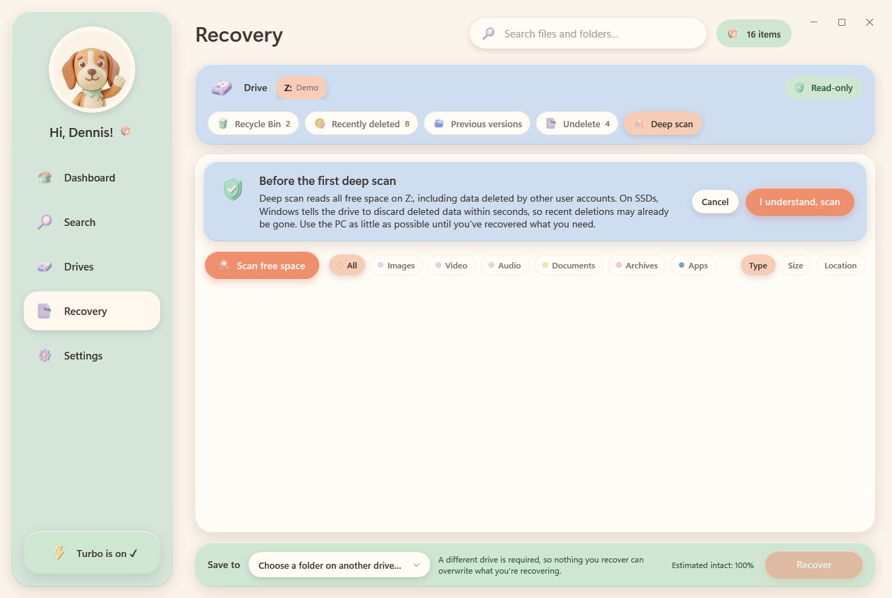
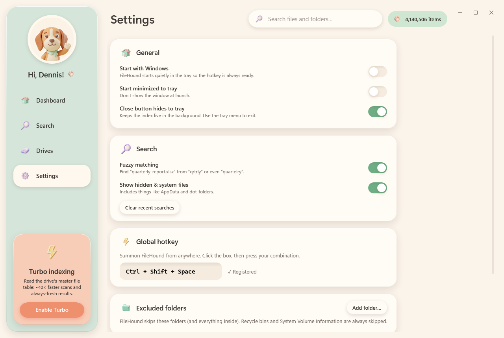

<p align="center"></p>

# FileHound

**Find any file on any drive as you type. Bring deleted ones back.**

FileHound is an open-source Windows 11 desktop app (C#, .NET 10, WPF) that indexes every file and folder on all your local drives and finds them instantly, even when you only remember part of a name or misspell it. Since 1.2 it also has a **Recovery** page that brings deleted files back from five sources, from the Recycle Bin all the way down to signature-carving the drive's free space, and tells you honestly what can and cannot come back.

It exists because the two things you want most when a file is missing, *where is it?* and *can I get it back?*, usually live in two different tools, one of which is grey and scary. FileHound puts both behind one hotkey, in a soft pastel "clay" interface with a hound who does the sniffing.

Who it is for: anyone on Windows who has more than one drive and has ever typed a filename into Explorer's search box and waited. Power users get Everything-style query syntax, an MFT-reading Turbo mode and DFXML exports; everyone else gets a search box that just works.


## Screenshots

| Search, fuzzy query | Drives |
|---|---|
|  |  |

| Recovery: Recently deleted | Recovery: Undelete |
|---|---|
|  |  |

| Recovery: Deep scan with preview | Recovery: Recycle Bin |
|---|---|
|  |  |

| Before the first deep scan | Settings |
|---|---|
|  |  |

## Install

Two downloads on the [latest release](https://github.com/Aldiharley/filehound/releases/latest). Pick one.

| | Installer `FileHound-Setup-v<version>.exe` | Portable `FileHound.exe` |
|---|---|---|
| What it does | Installs to `%LOCALAPPDATA%\Programs\FileHound` (or Program Files for all users) with a Start Menu entry, optional desktop shortcut and *Start with Windows*; uninstall from Settings → Apps | Runs from wherever you put it (for example `%LOCALAPPDATA%\Programs\FileHound`) |
| .NET | Checks for the **.NET 10 Desktop Runtime** and, if it is missing, downloads it from Microsoft (~60 MB) and installs it before FileHound | Not needed: the exe carries its own runtime |
| Size | ~5 MB (+ runtime when needed) | ~140 MB |
| Needs admin | No for a per-user install; the runtime installer asks once if it has to run | No |

Either way, Windows SmartScreen may warn the first time because the files are not code-signed; choose **More info → Run anyway**. To check a download, compare its hash with `SHA256SUMS.txt` from the same release:

```powershell
Get-FileHash .\FileHound.exe -Algorithm SHA256
```

Both need 64-bit Windows; the installer accepts Windows 10 1809 or later, and all testing happens on Windows 11.

## Quick start (60 seconds)

1. **Run it.** FileHound greets you by your Windows display name and starts indexing every ready drive in Standard mode. You can search while it works; the header chip shows the indexing progress until it is done.
2. **Press Ctrl+Alt+Space** from anywhere and type. Try `invce scan`: fuzzy matching finds `Invoice scan 2026-03.pdf`. Enter opens the top result, Ctrl+Enter opens its folder, Esc clears or hides.
3. **Turn on Turbo** (sidebar card, or Drives → *Enable Turbo*). One administrator approval, and FileHound relaunches reading each NTFS drive's master file table directly: millions of files in seconds, kept live by the change journal. Turbo also unlocks four of the five Recovery sources.
4. **Lost something?** Open **Recovery**, pick the drive, and work left to right through the tabs: Recycle Bin, Recently deleted, Undelete, Previous versions, Deep scan. Pick a folder on *another* drive and click Recover.
5. **Keep it ready.** Settings → *Start with Windows*, so the hotkey is always there. Closing the window hides it to the tray.

## Search

Type any part of a name. Results are ranked by match quality, best first:

- exact name
- prefix
- start of a word (`final_report`, `FinalReport`)
- anywhere in the name
- letters in order: `qrtrly` → *quarterly_report.xlsx*
- small typos: `quartelry`, `budjet`

A parallel, allocation-free engine searches 4 million entries in about 10–80 ms. Matched characters are highlighted, and category chips (Folders, Documents, Images, Video, Audio, Archives, Apps, Code) narrow the list with one click or Ctrl+1…9.

### Query syntax

| Query | Meaning |
|---|---|
| `budget 2025` | both words (AND) |
| `invoice \| receipt` | either word (OR) |
| `report !draft` | exclude names containing *draft* |
| `"my notes"` | exact phrase, including the space |
| `*.log`, `img_????.jpg` | wildcards (must match the whole name) |
| `ext:pdf;docx` | by extension |
| `type:image`, `kind:video` | by category: `doc`, `image`, `video`, `audio`, `archive`, `app`, `code`, `folder` |
| `folder:projects`, `file:readme` | folders only / files only |
| `size:>1gb`, `size:10mb..2gb`, `size:huge` | by size; the buckets are `empty`, `tiny`, `small`, `medium`, `large`, `huge` and `gigantic` |
| `dm:today`, `dm:week`, `dm:2026-05`, `dm:>2026-01-01` | by date modified |
| `path:work`, `src\core` | matches anywhere in the folder path |
| `drive:E` | one drive only |

### Keyboard

| Keys | Action |
|---|---|
| **Ctrl+Alt+Space** | Show/hide FileHound from anywhere. If another app owns it, FileHound falls back to Ctrl+Shift+Space; you can change it in Settings. |
| ↓ / ↑ | Move between the search box and results |
| Enter / double-click | Open |
| Ctrl+Enter | Open the containing folder with the item selected |
| Ctrl+Shift+C / Ctrl+C | Copy the path / copy the file |
| Alt+Enter | Properties |
| Ctrl+1…9 | Pick a category chip |
| Esc | Clear the search, or hide the window if the search is already empty |

You can also drag a result straight out into Explorer or another app (not while elevated; see [Privacy & safety](#privacy--safety)).

## Recovery

The **Recovery** page brings deleted files back, one NTFS drive at a time, from five sources. Cheapest and most reliable first:

| Tab | Where it looks | Needs Turbo | Recovered files go |
|---|---|---|---|
| **Recycle Bin** | Every `$Recycle.Bin` on the drive (other accounts' bins too when elevated) | no | back in place (*Restore*) or to a folder on another drive (*Recover*) |
| **Recently deleted** | A log of deletions FileHound builds from the NTFS change journal, including files that skipped the bin (Shift+Delete, command line, apps). Each entry shows whether its MFT record is still free | yes | to another drive |
| **Undelete** | The master file table's deleted records, read raw from the volume (or from the physical disk, or from a shadow copy, when security software blocks volume reads). Each record is graded against the cluster bitmap: *Excellent*, *Good* (header doesn't match the type), *Partially overwritten (N %)*, *Overwritten*, *Zeroed* (SSD TRIM), *Encrypted*. Sparse and LZNT1-compressed files are reassembled | yes | to another drive |
| **Previous versions** | Windows shadow copies (restore points). Paste a path and every snapshot that still holds it is listed, newest first. *Freeze this drive now* creates a snapshot on demand, after a warning that it writes to the drive | yes | next to the current file as `name (from <date>).ext` (*Restore*) or to any folder (*Save*) |
| **Deep scan** | Every free cluster, read for file signatures. 23 validators measure each hit exactly (JPEG, PNG, GIF, BMP, TIFF, WebP, WAV/AVI, MP4/MOV, MKV, OGG, MP3, FLAC, PDF, ZIP incl. docx/xlsx/pptx/epub/odt/jar, 7z, RAR, GZIP, SQLite, EXE/DLL, Office 97-2003, RTF, PST, LNK), so a result is a whole file or nothing. Pause/resume/stop, type filters, previews (images, text, ZIP entries). Results are named `type_block.ext` | yes | to another drive |

Every candidate carries a grade chip (*Excellent*, *Recoverable (slot intact)*, *Record reused*, *In Recycle Bin*, *Unknown*, and the Undelete grades above) with a tooltip saying what it means and why. Undelete re-reads the cluster bitmap right before copying, so clusters reused since the scan downgrade the grade instead of being copied as if intact.

Each recovered file is hashed (SHA-256) and listed in `manifest.csv` inside a `FileHound Recovery <date> <time>` folder. Any list exports as CSV, and a session exports as [DFXML](https://github.com/dfxml-working-group/dfxml_schema) with the byte runs each undeleted file was read from.

The deletion log lives in `%LOCALAPPDATA%\FileHound\recovery\<letter>_<serial>.dlog` (last 50,000 deletions per drive) and is backfilled from the journal's history the first time Turbo runs, so deletions from before FileHound was installed show up too, as far back as the journal reaches.

### What can't come back

FileHound grades rather than guesses, and some grades are final:

- **Zeroed (SSD TRIM).** On SSDs, Windows tells the drive to discard deleted data within seconds. If a file shows *Zeroed*, no copy of it exists on this drive. Deep scan cannot find it either.
- **Overwritten clusters.** Other files have been written over the space the deleted file used. *Partially overwritten (N %)* files come back with gaps; *Overwritten* ones do not come back.
- **Record reused.** Another file has taken the deleted file's MFT record, so its name and folder are gone. Deep scan can still find the contents by signature, but the result is named `type_block.ext`, not the original name.
- **Encrypted (EFS).** Files encrypted with EFS cannot be decrypted outside the account that encrypted them, so FileHound lists them but will not recover them.
- **Not NTFS.** Recently deleted, Undelete, Previous versions and Deep scan work on NTFS only. FAT/exFAT/ReFS volumes get the Recycle Bin tab.
- **Fragmented carving.** Deep scan recovers contiguous files only; Undelete handles fragmentation because the record holds the data runs.

The best thing you can do after an accidental delete is to use the PC as little as possible until you have recovered what you need. The page tells you this once, before the first deep scan.

## Indexing modes

| | Standard (default) | Turbo |
|---|---|---|
| How | Parallel folder walk (`FileSystemEnumerable`) | Reads the NTFS master file table (MFT) directly, the technique Everything uses; three tiers, see below |
| Live updates | FileSystemWatcher | USN change journal |
| Speed (C:, ~5M entries) | 24 s warm / 161 s cold | 7.8 s, including sizes and dates (file-record tier) |
| Speed (M:, 2.5M entries, HDD) | | 25.6 s cold / 9.5 s warm, including sizes and dates (raw tier) |
| Restart | snapshot in ~1 s, then a background refresh walk | snapshot in ~1.5 s, journal catch-up, ready in ~2.3 s |
| Needs | nothing | administrator approval, given once per launch via **Enable Turbo** |

Every ready fixed and removable drive is indexed, whatever its filesystem (NTFS, exFAT, FAT32, ReFS); Turbo applies to the NTFS ones and the rest stay in Standard mode. Each drive's index is saved as a compact binary snapshot, and 4 million entries load in about 1 second.

Turbo tries three ways of reading the MFT, fastest first, and falls back automatically:

1. **Raw `$MFT` read.** Sequential 4 MB reads straight from the volume, with names, sizes and dates in one pass. This is used unless the MFT is fragmented across extension records.
2. **Per-record reads with `FSCTL_GET_NTFS_FILE_RECORD`.** Several threads, one call per in-use record, still in one pass. This is used when raw volume reads are blocked; on the development PC, security software refuses them on C: with Win32 error 50.
3. **`FSCTL_ENUM_USN_DATA`.** This returns names only, and sizes and dates are filled in afterwards.

Turbo lists each hard-linked file under one of its names (as Everything does), while Standard mode lists every link. A freshly formatted NTFS volume has no change journal; Turbo creates a 64 MB one so live updates and the deletion log work there too.

If a live-update loop ever fails, FileHound says so and re-indexes the drive (at most once per ten minutes) instead of quietly going stale.

## Privacy & safety

- **Nothing leaves the machine.** No telemetry, no network calls from the app. The only download FileHound ever triggers is the installer fetching the .NET runtime from Microsoft when it is missing. Hashes and manifests are written only to the destination folder you chose.
- **Least privilege by default.** The exe runs as a normal user (`asInvoker`). Elevation happens only when you click *Enable Turbo*, and it is one approval per launch.
- **Elevated, but not for what you open.** When FileHound runs elevated it opens files and Properties through the normal desktop shell, so nothing you launch from it inherits admin rights. Drag-out is disabled while elevated, because Windows blocks dragging from an elevated app into a normal one.
- **Read-only recovery.** While the Recovery page is open on a drive, FileHound stops writing to it: no snapshot saves, no deletion-log saves. All raw reads go through read-only handles; the reader class exposes no write API. The one exception is *Freeze this drive now*, which says so and defaults to Cancel.
- **Different-drive rule.** Anything recovered (as opposed to restored in place) must go to a folder on another volume, so a recovery can never overwrite the data it is recovering. The page refuses a destination on the source volume.
- **Consent before the first deep scan.** The page explains once what a deep scan reads (all free space, including other accounts' deleted data), the SSD caveat, and why to use the PC as little as possible meanwhile.
- **Recovered programs are marked.** Carved `.exe`/`.dll`/scripts get the Mark-of-the-Web, so SmartScreen treats them as downloads rather than trusted local files.
- **Your data stays yours.** Everything is in `%LOCALAPPDATA%\FileHound` (see the [FAQ](#faq)); the uninstaller keeps your settings and deletion logs unless you delete the folder.

## Build & contribute

Requirements: Windows 10/11 and any [.NET 10 SDK](https://dotnet.microsoft.com/download). People who only run the published `FileHound.exe` need no .NET at all.

The quickest route is the bootstrap script. It installs the .NET 10 SDK if it is missing (winget first, Microsoft's per-user `dotnet-install` script as a fallback), then builds:

```powershell
.\build.ps1                 # check/install the SDK, build
.\build.ps1 -Test           # ...and run the tests
.\build.ps1 -Test -Install  # ...and publish FileHound.exe, install it for this user, add a Start Menu shortcut
.\build.ps1 -Installer      # build release\FileHound-Setup-v<version>.exe (needs Inno Setup 6: winget install JRSoftware.InnoSetup)
.\build.ps1 -NoInstallSdk   # fail instead of installing the SDK when it is missing
```

Or by hand:

```bash
dotnet build FileHound.sln -c Release
dotnet test FileHound.sln -c Release
dotnet run --project src/FileHound.App -c Release
```

To publish the self-contained single-file executable:

```bash
dotnet publish src/FileHound.App -c Release -r win-x64 --self-contained -p:PublishSingleFile=true -p:IncludeNativeLibrariesForSelfExtract=true -o publish
```

Two test categories are opt-in: `Perf` is a wall-clock budget tuned for a desktop, and `Elevated` tests format a throwaway VHDX and touch the real C: drive as administrator (CI excludes both with `--filter "Category!=Perf&Category!=Elevated"`).

### Headless tools

```bash
dotnet run --project tools/FileHound.Cli -c Release -- scan C D --fresh
dotnet run --project tools/FileHound.Cli -c Release -- search "qrtrly report" --top 10
dotnet run --project tools/FileHound.Cli -c Release -- bench "report" "ext:pdf invoice" "size:>1gb"
dotnet run --project tools/FileHound.Cli -c Release -- recovery-probe   # which raw-read paths work on a drive
```

The app has a QA mode that renders every page and Recovery tab to PNG: `FileHound.exe --snapshot <dir> [--query text] [--drives C] [--data dir]`. The screenshots in this README come from it, taken against a throwaway "Demo" volume so no personal files appear: [`tools/screenshots/demo-shots.ps1`](tools/screenshots/demo-shots.ps1) (run as administrator) creates the VHD, fills it with made-up documents and pictures, deletes some of them three different ways, captures every page, and detaches the volume again.

The banner at the top and the repository's social preview (`docs/banner/`) come from [`tools/assets/banner.ps1`](tools/assets/banner.ps1): the clay scene is generated with the Higgsfield CLI from the mascot reference, and the wordmark, tagline and chips are composited in Pillow by `banner_compose.py` so the text is crisp and exactly on-palette. Design notes: [`docs/superpowers/specs/2026-10-09-github-banner.md`](docs/superpowers/specs/2026-10-09-github-banner.md).

### Releasing

Releases are built by GitHub Actions ([`.github/workflows/release.yml`](.github/workflows/release.yml)). Set `<Version>` in `Directory.Build.props`, add a `### x.y.z` section under [Changelog](#changelog), commit, then push a matching tag:

```bash
git tag -a v1.4.2 -m "FileHound 1.4.2" && git push origin main --follow-tags
```

The workflow builds, runs the tests, publishes the self-contained exe and the framework-dependent build, compiles the installer, and attaches `FileHound-Setup-v<version>.exe`, `FileHound.exe`, the zip and `SHA256SUMS.txt` to a release whose notes come from that changelog section. It fails if the tag and `<Version>` disagree. Running it by hand (Actions → Release → Run workflow) builds the same files as a workflow artifact; tick *draft_release* to also rehearse the release step as a draft, which you then delete.

### Contributing

Issues and pull requests are welcome at [github.com/Aldiharley/filehound](https://github.com/Aldiharley/filehound/issues). Before opening a PR, run `.\build.ps1 -Test`; the history uses conventional-commit prefixes (`feat(indexing):`, `fix(app):`, `docs:`). Design docs live in [`docs/superpowers/specs`](docs/superpowers/specs), the implementation plans in [`docs/superpowers/plans`](docs/superpowers/plans), and background research in [`docs/research`](docs/research). Reading the spec for the area you are touching first saves everyone a review round.

## Architecture

```
FileHound.Core       pure .NET: struct-of-arrays VolumeIndex, query parser, matchers (fzf-style + Myers), SearchEngine, snapshots,
                     recovery models, Recycle Bin $I parser, deletion-log store, LZNT1 decoder, CSV/DFXML exports,
                     carving: signature table + 23 pure validators (exact size or reject)
FileHound.Indexing   Win32: drive discovery, MFT scanner, USN updater, parallel walker, FileSystemWatcher, IndexManager,
                     recovery: deletion log, journal gap oracle, Recycle Bin source, VolumeReader (volume / physical disk /
                     shadow copy), ClusterBitmap, MftUndeleteSource + UndeleteWriter, ShadowCopySource, Carver + CarveWriter,
                     RecoverySession
FileHound.App        WPF + CommunityToolkit.Mvvm: clay theme, Dashboard / Search / Drives / Recovery / Settings, tray, hotkey
tools/FileHound.Cli  headless scan / search / bench / recovery-probe
```

## FAQ

**Windows says "Windows protected your PC" when I run it.**
The downloads are not code-signed, so SmartScreen has no reputation for them. Click **More info → Run anyway**. Verify the file first if you like: compare `Get-FileHash .\FileHound.exe -Algorithm SHA256` with `SHA256SUMS.txt` from the same release.

**Why does Turbo need administrator rights?**
Turbo reads the NTFS master file table and the USN change journal directly instead of walking folders. Windows only hands out those raw volume handles to elevated processes. FileHound asks once per launch when you click *Enable Turbo*, relaunches itself elevated, and still opens files through the normal desktop shell so nothing you open inherits admin rights. Standard mode works without any of this; it is just slower on big disks.

**Recently deleted is empty on my new or freshly formatted drive. Is something wrong?**
No. That tab is built from the drive's change journal, and a new journal has no history to backfill. A freshly formatted NTFS volume has no journal at all; Turbo creates one (64 MB), so from that point on deletions are logged. On a long-used drive the backfill reaches as far as the journal does, which on a busy system drive is typically hours to days. If the tab says "Still indexing" or "indexed in Standard mode", it tells you why and fills in by itself once Turbo has finished with that drive.

**A file I deleted a minute ago shows *Zeroed*. Why?**
On SSDs, Windows tells the drive to discard deleted data within seconds (TRIM). The file's record and name are still in the MFT, but the clusters read back as zeros; no copy of it exists on this drive. Check Previous versions (if the drive has shadow copies) or a backup. This is why the deep-scan consent card asks you to use the PC as little as possible after an accidental delete.

**Ctrl+Alt+Space does nothing, or opens something else.**
Another app registered the same shortcut first. FileHound then picks the first free alternative (usually **Ctrl+Shift+Space**); **Settings → Global hotkey** shows the active combination with a status line, and you can click the box and press any other combination to change it.

**Where does FileHound keep its data?**
`%LOCALAPPDATA%\FileHound`: `settings.json` (settings and recent searches), `index\*.fhx` (one snapshot per drive, rebuildable), `recovery\*.dlog` (deletion logs, last 50,000 deletions per drive) and `logs\`. Settings → About has *Open logs folder* and *Open index folder* buttons. Nothing is written anywhere else except the recovery destination you choose.

**How do I uninstall it completely?**
Installer: Settings → Apps → FileHound → Uninstall. That removes the program, the shortcuts, the start-with-Windows entry and the rebuildable `index\` and `logs\` folders, and keeps `settings.json` and the deletion logs for a reinstall; delete `%LOCALAPPDATA%\FileHound` to remove those too. Portable exe: turn off *Start with Windows* in Settings if you had enabled it, exit FileHound from the tray, then delete the exe and that folder.

**Does it search inside files?**
No. FileHound indexes names, paths, sizes, dates and attributes, not contents. Full-text search, network shares and a background indexing service are out of scope for now.

## Changelog

### 1.4.2

- **Recently deleted** now reports a file moved to the Recycle Bin from the journal's history under its original name and folder (`Notes.txt` in `Documents`, not `$R1A2B3C.txt`), and checks whether a deleted file's record is still free by reading the record itself, so the grade is right on drives where the file-record FSCTL is not available.
- Rows with an unknown size show nothing instead of an ellipsis that looked like loading, and the recovery bar's hint no longer runs under the selection summary.
- README rewritten; screenshots are rendered against a throwaway demo volume by `tools\screenshots\demo-shots.ps1`.

### 1.4.1

- **Windows installer.** `FileHound-Setup-v<version>.exe` installs FileHound per user (or for all users) with a Start Menu entry, optional desktop shortcut and *Start with Windows*, and uninstalls from Settings → Apps. It ships the small framework-dependent build; when the .NET 10 Desktop Runtime is missing it downloads Microsoft's installer (~60 MB) and runs it first. The portable self-contained `FileHound.exe` is unchanged. Build it yourself with `.\build.ps1 -Installer` (Inno Setup 6).

### 1.4.0

- **Deep scan tab** (Turbo). Reads the drive's free clusters through `VolumeReader` and recognises files by signature with 23 pure validators that walk each format's structure and return an exact size (JPEG marker walk, PNG chunks with CRC, ISO-BMFF boxes, MKV EBML, MP3 frames, ZIP central directory, PE sections, OLE2 FAT, …). Hits are de-duplicated against Undelete, streamed into the list as they are found, filtered by type, sorted by type/size/location, and previewed (images decoded from memory, text snippets, ZIP entry lists). Pause, resume and stop; progress with an ETA in the header chip.
- **One-time consent** (FR-30) before the first deep scan, remembered in settings.
- Carved files recover as `type_block.ext` with SHA-256 and byte runs; recovered programs get the Mark-of-the-Web.
- Every validator is fuzzed in the test suite (random mutations must never throw or report a size past the data).
- **Fixes.** Snapshot saves of one drive could overlap when several drives finished indexing seconds apart and the second one failed with a sharing violation; saves are now serialised per file. A freshly formatted NTFS volume has no change journal, which silently dropped it to Standard mode; Turbo now creates a 64 MB journal (as Everything does), so live updates and the deletion log work there too. Recently deleted now explains why a drive has no deletion log yet ("Still indexing O: (2%)", Standard mode) instead of asking for administrator access while Turbo is already on, and attaches itself when the log appears.

### 1.3.0

- **Undelete tab** (Turbo). Scans the master file table for deleted records, rebuilds each file's folder from the live index and other deleted folders (checking record sequence numbers so a reused folder is not trusted), and grades every candidate against the cluster bitmap plus a first-cluster signature check. Recovery reassembles data runs, zero-fills sparse runs, decompresses LZNT1 units, truncates to the real size, restores timestamps and hashes on the way; the bitmap is re-checked right before copying.
- **Reads the drive three ways.** `VolumeReader` tries the volume handle, then the physical disk at the partition offset, then the newest shadow-copy device, so Undelete works on system drives where security software refuses raw volume reads (the case on the development PC).
- **Previous versions tab** (Turbo). Lists every shadow copy that still holds a path, newest first, with *Restore* (next to the current file, never overwriting) and *Save to a folder*. *Freeze this drive now* creates a snapshot via `Win32_ShadowCopy` after a warning whose default is Cancel.
- The header status chip shows undelete progress and jumps back to Recovery when clicked; DFXML exports now carry `byte_run`s; the Recycle Bin and Previous versions tabs gained *Save to a folder…* for copying instead of restoring.
- Acceptance test: an elevated round trip on a throwaway VHDX (format, write, delete, overwrite, undelete, compare SHA-256).

### 1.2.0

- **Recovery page.** A new sidebar page brings deleted files back, drive by drive (see [Recovery](#recovery)):
  - **Recycle Bin tab.** Lists every bin on the drive with original name, folder, size and deletion time, parsed from the `$I` metadata files (v1 and v2). *Restore* puts items back in place (adding "(restored)" when the name is taken); *Recover* copies them to another drive.
  - **Recently deleted tab** (Turbo). FileHound now keeps a per-drive log of deletions from the USN change journal: plain deletes, moves to the Recycle Bin, Windows 11 POSIX deletes (the `$Extend\$Deleted` marker) and "replaced" saves. It is backfilled from the journal's history, hides temp/cache noise by default, and checks whether each file's MFT record is still free.
  - **Read-only sessions and the different-drive rule.** Opening the page on a drive suspends FileHound's own writes to it, and recovered files must go to another volume.
  - **Forensic extras.** SHA-256 per recovered file, `manifest.csv`, CSV export of any list and DFXML export of the session.
- **Turbo on Windows 11 POSIX deletes.** The journal updater now recognises the rename into `\$Extend\$Deleted` as the deletion, so such files leave the index immediately instead of when the later `FILE_DELETE` record arrives.
- New clay assets: a digging hound, a hound with a rescued file, and icons for Recycle Bin, timeline, undelete, shadow copies, deep scan, read-only and export.
- `FileHound.Cli recovery-probe` reports which raw-read paths (volume, physical disk, shadow copy) work on a drive.

### 1.1.0

- **Much faster Turbo indexing.** Turbo now reads the NTFS master file table itself and gets names, sizes and dates in one pass, with no separate "measuring files" step. It tries three ways, fastest first, and falls back automatically:
  - **Raw `$MFT` read.** Large sequential reads straight from the volume. On a 2.5M-entry HDD this takes 25.6 s cold and 9.5 s warm.
  - **Per-record reads with `FSCTL_GET_NTFS_FILE_RECORD`.** Used when security software blocks raw volume reads. A 5M-entry C: drive is indexed in 7.8 s, against 9 s plus a 20 s fill before.
  - **`FSCTL_ENUM_USN_DATA`.** The 1.0 method, kept as the last resort.

  Results were checked against the 1.0 method: entry counts are identical on both drives tested, and sampled sizes match the disk.
- **Greeting by name.** The sidebar uses your Windows display name (first name) and Settings → General gets a *Your name* override.
- **Self-contained release build and `build.ps1`.** The script installs the .NET 10 SDK if it is missing, then builds, tests, publishes and installs. Any 10.0.x SDK now satisfies `global.json`.
- **Safer Turbo mode.** Explorer is always launched by its full path, and Alt+Enter Properties is shown by the desktop's own Explorer instead of the elevated process, so nothing started from the sheet inherits admin rights.
- **No overlap on the Turbo relaunch.** The old instance keeps its lock until snapshots and settings are saved; the elevated copy waits for it.
- **Live updates report faults.** If the USN or FileSystemWatcher loop hits an unexpected error it is logged and the drive is re-indexed (at most once per ten minutes) instead of the index silently going stale.
- **Walker can no longer hang.** An unexpected error in one worker fails the walk with that error instead of leaving the drive stuck in *Scanning*.
- **MFT parser.** Bounds checks can no longer overflow on a corrupt record length; such records are skipped rather than knocking the drive back to Standard mode.
- Superseded indexes are released sooner during a refresh, and the snapshot-release test no longer depends on garbage-collection timing.

### 1.0.0

Initial version: whole-disk indexing in Standard and Turbo modes, fuzzy search with Everything-style syntax, snapshots, tray and global hotkey.

## License

Apache-2.0. See [`THIRD-PARTY-NOTICES.md`](THIRD-PARTY-NOTICES.md) for adapted work (fzf scoring, MIT; the LZNT1 decoder, written from the MS-XCA description with DiscUtils as reference, MIT) and the NuGet packages.
